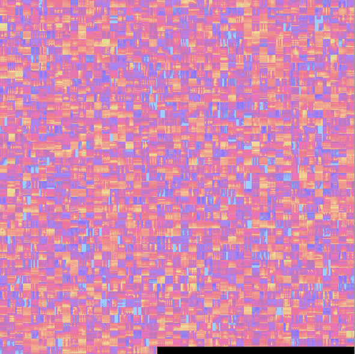

# scatter-sounds

This a web visualization and listening project based on [scatter-gl](), web-audio and tensorflow-hub AI sound models. Most of the time sound datasets are explored visually mainly through spectrograms or other time-frequency representation. This is an effort to show how fast you can overview a dataset through hearing it ordered in a similarity space. 

Python preprocessing scripts are provided to handle single long audios, or datasets of sound clips that are stored in a single folder like ESC-50 or urbansound8k. The model used to generate the similarity space is [YAMNet](https://github.com/tensorflow/models/tree/master/research/audioset/yamnet) which is easily aviable throug the [tensorflow-hub](https://tfhub.dev/google/yamnet/1) repository.

## Usage 

The wepbage need 4 files to render the sound dataset.

* **config.json:** Store metadata of the dataset and paths to the data files.
* **projections.json:** Store the 3d projections of the YAMNet embeddings, labels and other useful metadata of the clips. 
* **sprite.jpg:** The spritesheet image of log-melspectrograms that uses the YAMNet model for each clip of the dataset.
* **audio.flac:** The "spriteclip" audio with all the dataset clips merged.


**ESC50 Sprite example**
### Data preprocessing

The python preprocessing script would receive as input a path to a folder that contains audio clips, or a path to a long audio file. 

#### dataset case
Audio clips on a folder(E.g. Esc50, UB8k)

```
cd preprocess 
python preprocess.py -d <path_to_audio_folder>
```

This would try to:
1. Load all the audios in the folder
2. Extract a clip region around the signal maximum amplitude of 0.96 seconds(YAMNet window analysis size). If the clip has a duration less than 0.96 seconds it would be padded with zeros.
3. Merge all trimmed clips, and resample the merged audio to the expected model sample rate(16Khz).
4. Get the the YAMNet embeddings and Log-melspectrogram of the merged signal. 
  Note: odd index embeddings are discarded to get one embedding per clip, and avoid clipwise aggregation and inference. 
6. Compute audio descriptors and parse labels from clip filenames for the metadata.
7. Reduce the dimensionality of the YAMNet emb(1024) to 3 components.
8. Generate the spritesheet image, the sprite clip, and the projections file. 

A parse label function and a label list have to defined and passed as arguments to `process_clips_from_folder` function. Examples are provided for ESC50, and urbansound8k dataset. 

#### long audio case

```
cd preprocess
python preprocess.py -f <path_to_long_audio>
```

This would try to. 
1. Load the long audio. 
2. Resample to the expected model sample rate(16Khz).
3. Get the the YAMNet embeddings and Log-melspectrogram of the signal.
4. Compute audio descriptors and generate filenames to display of the starting second of the segment for the metadata.
5. Reduce the dimensionality of the YAMNet emb(1024) to 3 components.
6. Generate the spritesheet image, the sprite clip, and the projections file. 

The generated files are stored in the data folder of the project, once they are generated you can pass as url argument the name of your dataset and it will be rendered. 


